# 1预测模型

## 1.1  2028奥运会奖牌榜预测模型

- 模型确立

  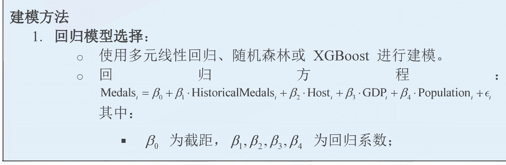

  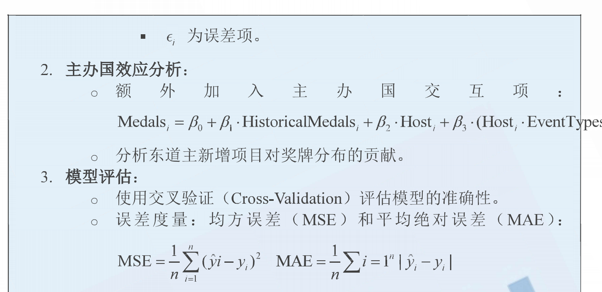

  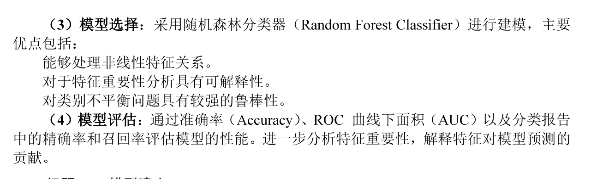

- 特征提取：

  - 国家的历史数据

    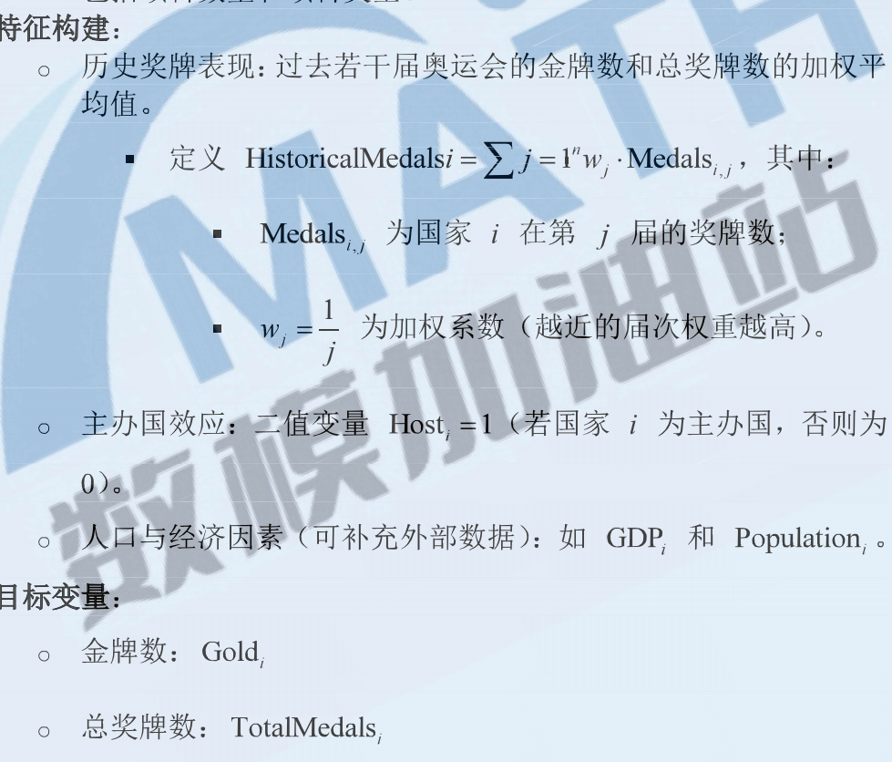

  - 运动员的历年数据

  - 主办国

- 特征重要性分析

  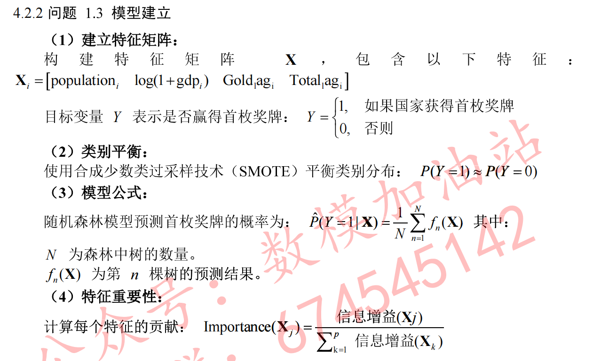

## 1.2首次获奖国家的预测：人数和具体的国家

- 筛选尚未获奖的国家的名单

- 直接用论文里面的思路（这样做的弊端就是会用到其他的数据集进行建模，可能会被视为没有认真读题）

- 或者也可以自己选择方法，比如：

  - 直接利用1.1模型的预测值，对之前从未获奖的国家进行排序，然后取前5位

    

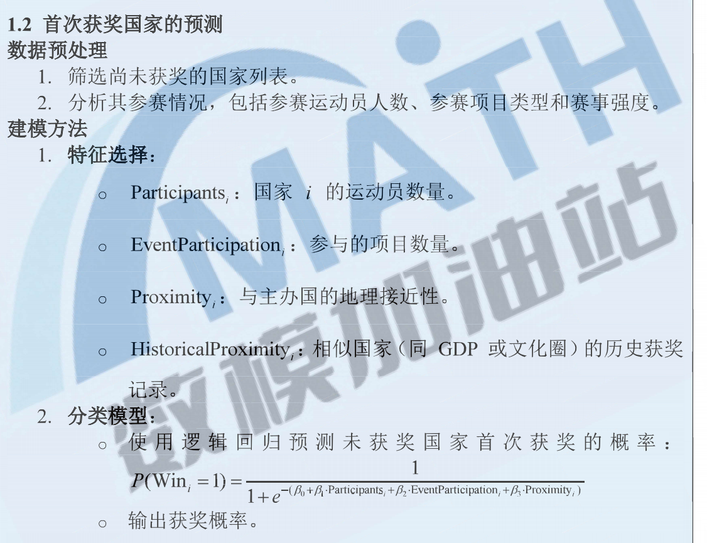

## 1.3，项目设置与奖牌之间的关系；主办国的影响

### 1.3.1项目设置的影响

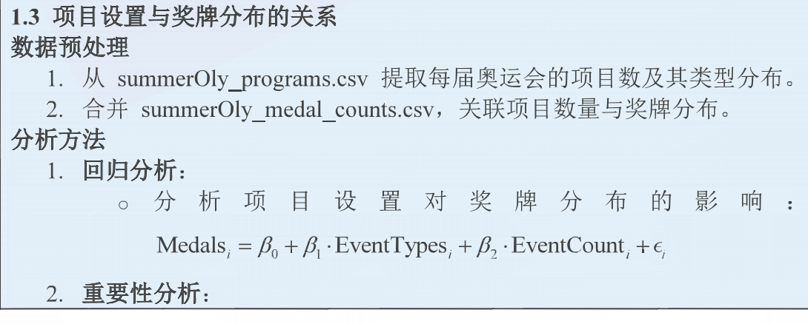

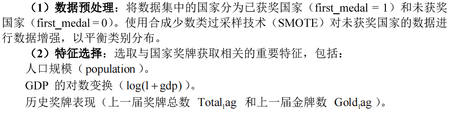

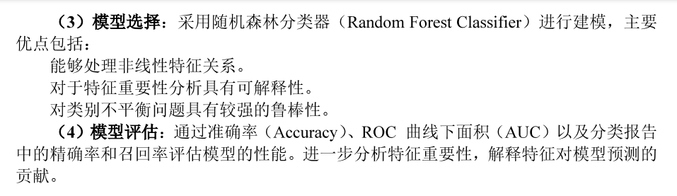

### 1.3.2主办国影响

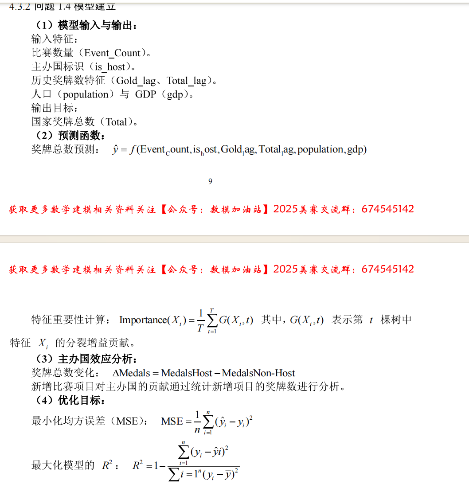

# 2教练效应

## 2.1教练效应对于奖牌数的影响

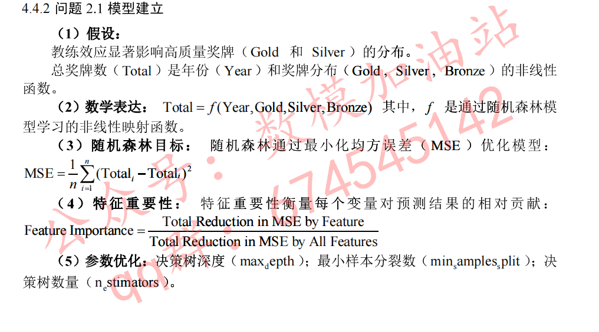

## 2.2选择三个国家给出利用教练效应提升奖牌数的具体建议

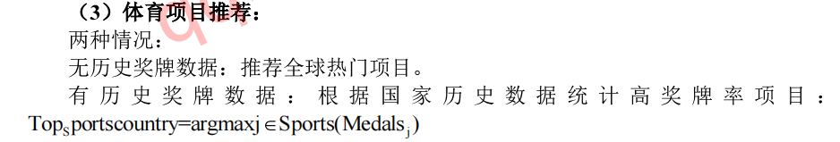

# 3给各国组委会提出建议

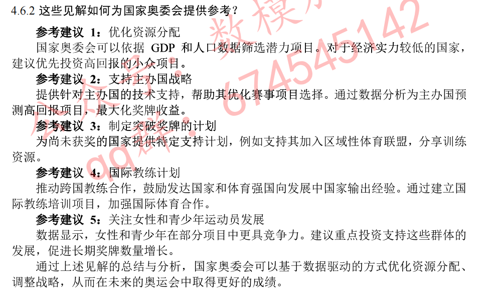